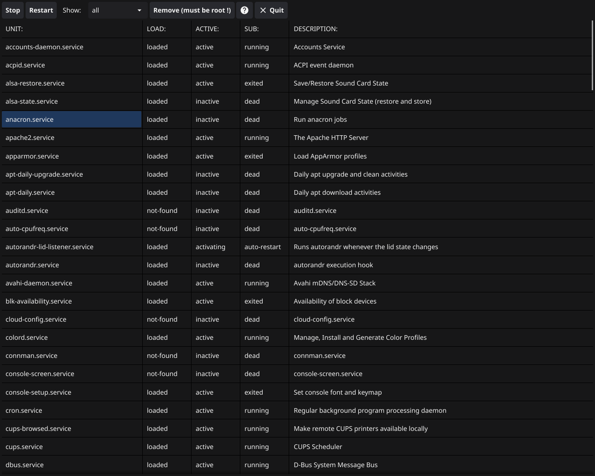

# Servicegui

Introduction:
Servicegui is a Go-based application developed using the Fyne framework. It provides a graphical user interface for managing systemd services on Linux systems. With Servicegui, users can easily view, start, stop, restart, and remove systemd services.

Features:
- List running systemd services.
- Filter services based on their states: active, inactive, or all.
- Perform actions like stop, restart, and remove on selected services.
- User-friendly GUI built with Fyne.
<p align="center"></p>

Installation:
Prerequisites
- Go (version 1.x or higher)
- Fyne dependencies for your platform

Clone the repository:
```
git clone https://github.com/lennart1978/servicegui.git
```
Navigate to the cloned directory:
```
cd servicegui
```
Build the application:
```
go mod tidy
go build .
```
To run Servicegui, execute the following command in the terminal:
```
./servicegui
```
The application will start and display the list of services. Use the provided buttons and dropdown menu to interact with the services.
### Please note that I am not responsible for any consequential damage caused by Servicegui!
### If you don't know exactly what you're doing, please don't use this program!

License:
ServiceGUI is released under the MIT License. See the LICENSE file in the repository for more details.


